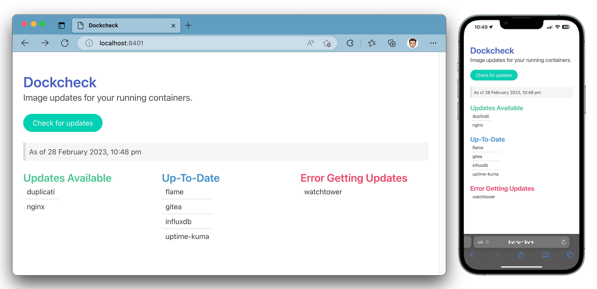

# dockcheck-web

A webpage showing available image updates for your running containers.



## Forked from [Palleri/dockcheck-web](https://github.com/Palleri/dockcheck-web)

## Changes from upstream dockcheck-web
* Data volume separate from the web app code
* Optional check on startup via the `CHECK_ON_LAUNCH` environment variable
* API endpoints to trigger update check and running state
* Mobile-friendly styling using [Bulma](https://bulma.io/)
* Leaner entrypoint script
* Customizable page/window titles
* Show last update date/time on page

docker-compose.yml
```yml
version: '3.2'
services:
  dockcheck-web:
    container_name: dockcheck-web
    image: 'ghcr.io/supermamon/dockcheck-web:latest'
    restart: unless-stopped
    ports:
      - '8401:80'
    volumes:
      - ./data:/data
      - /var/run/docker.sock:/var/run/docker.sock:ro
      - /etc/localtime:/etc/localtime:ro
    environment:
      - NOTIFY=true # optional
      - NOTIFY_URLS=discord://Dockcheck-web@xxxxx/xxxxxx #optional
      - EXCLUDE=nginx,plex,prowlarr  #optional
      - CHECK_ON_LAUNCH=true # optional
      - PAGE_TITLE=Dockcheck # optional
      - WINDOW_TITLE=Dockcheck #optional
      - TZ=Europe/London
```

---

## Configuration Options

### Environment Variables

| Variable        | Default   | Description                           |
| --------------- | --------- | ------------------------------------- |
| NOTIFY          | false     | Enable notifications                  |
| NOTIFY_DEBUG    |           | Enable notifications DEBUG mode. Be carefull, your tokens and passwords might be visible in docker logs. | 
| NOTIFY_URLS     |           | See Notifications section             |
| EXCLUDE         |           | Exclude containers from update check  |
| HTTP_PROXY      |           |                                       |
| HTTPS_PROXY     |           |                                       |
| CHECK_ON_LAUNCH | true      | Run `dockcheck` when container starts |
| PAGE_TITLE      | Dockcheck | Custom web page title                 |
| WINDOW_TITLE    | Dockcheck | Custom window title                   |
| TZ              |           | Timezone to use for displaying date/time on the page |

### Volumes

* `/data` : to store the list of udpates. Mount if you want to persists the results of the last check even after restarting the container.

---

## Notifications
This image use [apprise](https://github.com/caronc/apprise) for notifications


Example notification setup  
```yml
version: '3.2'
services:
  ...
    environment:
      - NOTIFY=true
      - NOTIFY_URLS="slack://sometoken1/sometoken2/sometoken3/"
  ...
```

### Example for multiple urls

```yml
version: '3.2'
services:
  ...
    environment:
      - NOTIFY=true
      - NOTIFY_URLS="discord://Dockcheck-web@xxxxx/xxxxxx tgram://0123456789:RandomLettersAndNumbers-2morestuff-123456789"
  ...
```
